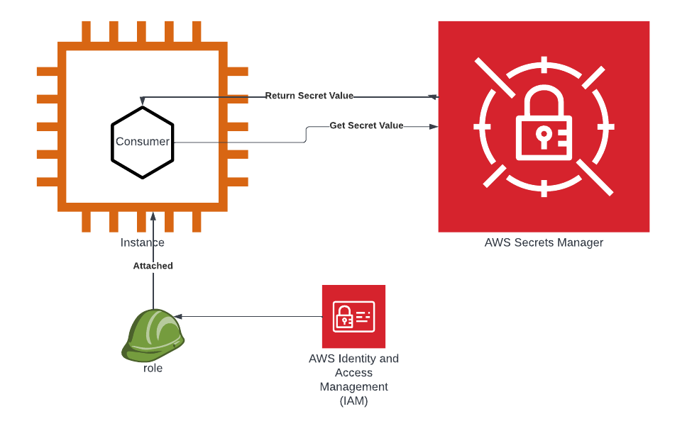

# poc

## Description

> "Applications must sign their API requests with AWS credentials. Therefore,
if you are an application developer, you need a strategy for managing
credentials for your applications that run on EC2 instances. For example, you
can securely distribute your AWS credentials to the instances, enabling the
applications on those instances to use your credentials to sign requests,
while protecting your credentials from other users. However, it's
challenging to securely distribute credentials to each instance, especially
those that AWS creates on your behalf, such as Spot Instances or instances in
Auto Scaling groups. You must also be able to update the credentials on each
instance when you rotate your AWS credentials."
</br>-- [AWS Documentation][1]

A POC for running an "application" on AWS EC2 while consuming (reading) secrets from
AWS secrets manager (SM) using IAM Roles instead of creds distribution

## Arcitecture

- A secret generated and tracked in SM
- IAM Role for EC2 - with a policy to read secrets from SM
- An EC2 instance with an assosicated IAM Role
- Consumer container ("application")- running in the EC2 instance which
  consumes the secret



## local DEV Environment

### pre-commit

To run pre-commit locally, follow the instructions:

```shell
pip install --user pre-commit
pre-commit install
```

### Dependencies update

[Renovate][2] takes care of it

## PROD environment

### System Requirements

- AWS [credentials settings][1], profile __default__
- `make`
- `podman` or `docker`

### Environment init

```shell
make init
```

### Environment reconfigure

```shell
make reconfigure
```

### Environment Up

```shell
make up
```

### Environment Down

```shell
make down
```

[1]: https://docs.aws.amazon.com/AWSEC2/latest/UserGuide/iam-roles-for-amazon-ec2.html
[2]: https://github.com/renovatebot/renovate

## Create DEV environment

You can create your DEV environment from local.
The DEV environment shall incude a CRC-Cloud (=openshift local),
in which our consumer container will be running at.

### Basic requirements

**Note:** You can find more details of the CRC-Cloud repo
[here](https://github.com/crc-org/crc-cloud#crc-cloud---runs-containers-in-the-cloud)

- Register a Red Hat account and get a pull secret from
  [here](https://console.redhat.com/openshift/create/local)
- **The location of the pull-secret.txt** file is defined under
  **PULL_SECRET_ABS_PATH variable on our Makefile**.
  MAKE SURE IT IS CORRECT according to where you have located it. Change it
  accordingly, if needed.
- Create an access key for your AWS account and grab the ACCESS_KEY_ID
  and the SECRET_ACCESS_KEY (instructions can be found
  [here](https://docs.aws.amazon.com/general/latest/gr/aws-sec-cred-types.html)

### DEV environment creation

**MAKE SURE** you have torn-down an already-existing environment before
creating a new one.

You will have to manually delete the resources in aws
otherwise.

In order to create such a DEV environment, you will need to run the following
make command:

```shell
make dev-up
```

If the command worked properly, you should be seeing a few new files
under your current directory:

- _host_
- _id_rsa_
- _username_
- _password_
- _pull-secret.txt_

#### Access the environment

In order for you to access the cluster, enter the following url

`https://console-openshift-console.apps.**IP-FROM-HOST-FILE**.nip.io`

You can then access the cluster as **"kubeadmin"** or **"developer"** user.

The **password** for both users is found under the _password_ file.

**WARNING:** if you delete the working directory **CRC-Cloud** won't be able to
teardown the cluster so be **extremely careful** with the workspace folder content.

### DEV environment teardown

In order to teardown the DEV environment, you will need to run the following
make command:

```shell
make dev-down
```

The command will delete all your aws resources, and remove the crc-cloud container.
